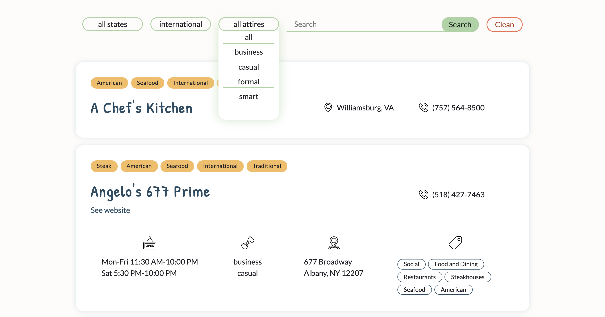
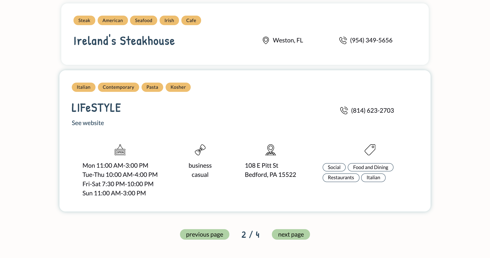
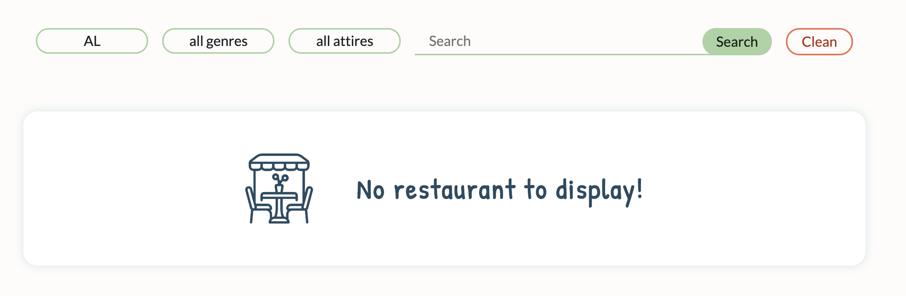
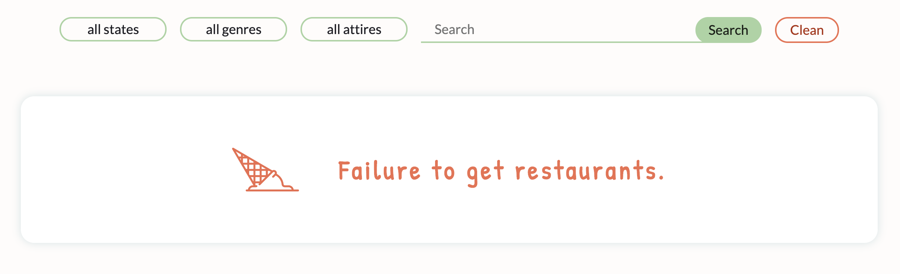
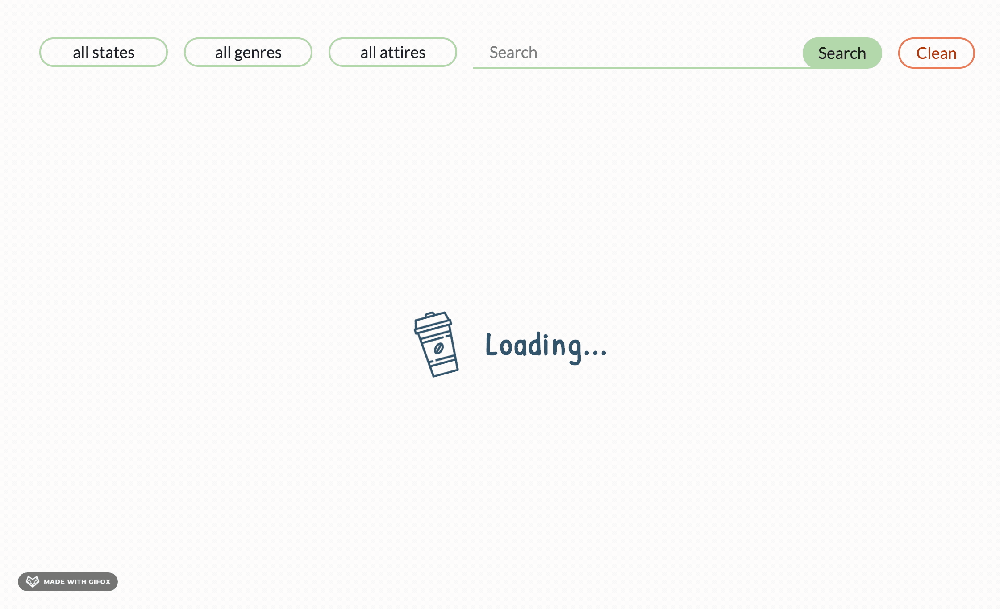

# Restaurant Guide

## Overview

Restaurant Guide is an app contains information about restaurants such as website, business hours, address, phone, genres, attires, tags. All restaurants can be searched by genre, state, attire, name and city.

[Deployed app](https://restaurant-guide-challenge.herokuapp.com/).

## Setup

Download to local machine:

- clone the repo to your local machine

- run `npm install` to download all necessary dependencies

- run `npm start` to run the server

## Tech Stack

- TypeScript
- React
- Redux
- Jest with Enzyme
- ESLint
- Sass
- TravisCI
- Heroku

## UI components

**No Card**

**Error Card**

**Loading Image**

